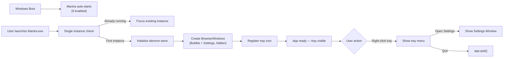

# Feature 01 — Electron App Shell + System Tray

## Overview
Bootstrap the Electron application with a persistent system tray icon, a frameless always-on-top BrowserWindow for rendering bubbles, and a separate frameless Settings window. This is the foundation all other features depend on.

## Scope
**Included:**
- Electron main process bootstrap (`src/main/index.ts`)
- System tray icon with context menu (Open Settings, Quit)
- Bubble BrowserWindow: frameless, always-on-top, transparent, click-through when no bubbles visible
- Settings BrowserWindow: separate window, fixed 560×600px, standard frame hidden
- Preload script exposing safe IPC APIs to renderer
- electron-store initialization with default settings and schema version
- App auto-start on Windows login (toggleable via settings)
- Single instance lock (prevent duplicate Mantra processes)

**Excluded:**
- Any UI content inside the windows (covered in Features 04 and 06)
- Context menu registration (Feature 02)
- Translation logic (Feature 03)

## User Stories

### US-01-A: App runs silently in tray on launch
**As a** manga reader,
**I want** Mantra to start and live in the system tray without interrupting my reading,
**So that** I can keep it running in the background and use it on demand.

**Acceptance Criteria:**
- [ ] App launches and a Mantra tray icon appears in Windows system tray
- [ ] No main window opens on launch (only tray icon)
- [ ] Tray icon right-click shows menu: "Open Settings", separator, "Quit Mantra"
- [ ] "Quit Mantra" fully exits the process (not just hides)
- [ ] If app is already running and launched again, focus existing instance instead of spawning new one

### US-01-B: Bubble window is transparent and click-through when empty
**As a** user,
**I want** the overlay window to be invisible and non-blocking when no bubbles are shown,
**So that** Mantra doesn't interfere with browsing or reading.

**Acceptance Criteria:**
- [ ] Bubble BrowserWindow covers full screen (width: screen.width, height: screen.height)
- [ ] Window is transparent (no background color visible)
- [ ] When zero bubbles are active, all mouse events pass through (setIgnoreMouseEvents(true, { forward: true }))
- [ ] When one or more bubbles are active, mouse events are captured for bubble interaction
- [ ] Window is always-on-top (level: 'screen-saver' on Windows)

### US-01-C: Settings window opens from tray
**As a** user,
**I want** to open the Settings panel from the tray menu,
**So that** I can configure Mantra without hunting for it.

**Acceptance Criteria:**
- [ ] Clicking "Open Settings" opens the Settings BrowserWindow (560×600px, centered)
- [ ] If Settings window already open, bring it to front (focus) instead of opening a second one
- [ ] Settings window can be closed via standard OS close button (X)
- [ ] Closing Settings window does not quit the app

### US-01-D: electron-store initialized with defaults on first run
**As a** developer/AI agent,
**I want** electron-store to be initialized with all default values on first launch,
**So that** all features can read settings without null checks.

**Acceptance Criteria:**
- [ ] On first launch, `schema_version` = 1 is written to store
- [ ] Default settings object matches `ISettings` defaults from `01_technical_specs.md`
- [ ] Default history array `[]` is written
- [ ] Subsequent launches do not overwrite existing store data

## User Flow


## Implementation Notes

### BrowserWindow Configuration
```typescript
// Bubble overlay window
const bubbleWindow = new BrowserWindow({
  width: screen.getPrimaryDisplay().workAreaSize.width,
  height: screen.getPrimaryDisplay().workAreaSize.height,
  x: 0, y: 0,
  transparent: true,
  frame: false,
  alwaysOnTop: true,
  skipTaskbar: true,
  hasShadow: false,
  webPreferences: {
    preload: path.join(__dirname, 'preload.js'),
    contextIsolation: true,
    nodeIntegration: false,
  }
});
bubbleWindow.setIgnoreMouseEvents(true, { forward: true });
bubbleWindow.setAlwaysOnTop(true, 'screen-saver');

// Settings window
const settingsWindow = new BrowserWindow({
  width: 560, height: 600,
  frame: false,                  // Custom title bar in React
  resizable: false,
  center: true,
  show: false,                   // Show only when triggered
  webPreferences: {
    preload: path.join(__dirname, 'preload.js'),
    contextIsolation: true,
    nodeIntegration: false,
  }
});
```

### Enabling Mouse Events When Bubbles Are Active
```typescript
// Called from renderer via IPC whenever bubble count changes
ipcMain.handle('set-mouse-events', (_, { ignore }: { ignore: boolean }) => {
  if (ignore) {
    bubbleWindow.setIgnoreMouseEvents(true, { forward: true });
  } else {
    bubbleWindow.setIgnoreMouseEvents(false);
  }
});
```

### Single Instance Lock
```typescript
const gotLock = app.requestSingleInstanceLock();
if (!gotLock) {
  app.quit();
} else {
  app.on('second-instance', () => {
    if (settingsWindow) {
      settingsWindow.show();
      settingsWindow.focus();
    }
  });
}
```

### electron-store Default Initialization
```typescript
import Store from 'electron-store';
import { ISettings } from '../renderer/types';

const DEFAULT_SETTINGS: ISettings = {
  targetLanguage: 'id',
  translationProvider: 'mymemory',
  aiProvider: 'none',
  ollamaModel: 'mistral',
  ollamaBaseUrl: 'http://localhost:11434',
  groqApiKey: '',
  autoImprove: false,
  bubbleOpacity: 0.95,
  startOnBoot: false,
  minimizeToTray: true,
};

const store = new Store({ schema: { ... } });

if (!store.has('schema_version')) {
  store.set('schema_version', 1);
  store.set('settings', DEFAULT_SETTINGS);
  store.set('history', []);
}
```

## Edge Cases
| Case | Expected Behavior |
|------|------------------|
| User has multiple monitors | Bubble window covers primary monitor only |
| User disconnects monitor mid-session | Re-calculate screen dimensions on display-removed event |
| Mantra crashes and leaves tray ghost | On re-launch, single instance lock succeeds normally |
| electron-store file is corrupted | Catch JSON parse error; reset to defaults and log warning |
| Windows restarts with auto-start enabled | App launches silently to tray, no splash screen |
| User clicks tray icon (left-click) | Open Settings (same as right-click → Open Settings) |

## Definition of Done
- [ ] All acceptance criteria above pass
- [ ] App launches to tray with no visible window
- [ ] Bubble window verified transparent and click-through via manual test
- [ ] Settings window opens, centers, and is closeable without quitting app
- [ ] electron-store defaults verified in %APPDATA%/mantra/config.json
- [ ] Single instance lock tested: launching Mantra.exe twice shows only one tray icon
- [ ] `docs/04_dev_log.md` updated
- [ ] Status in `docs/00_master_plan.md` updated to ✅ Done
