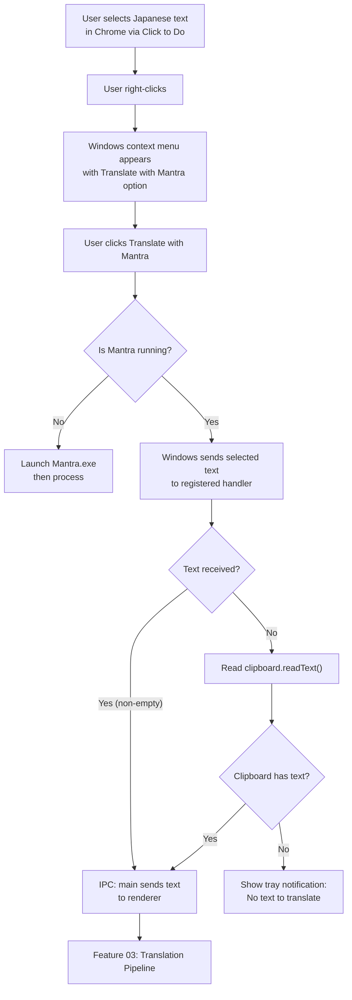

# Feature 02 — Windows Context Menu Integration

## Overview

Register Mantra as a custom action in the Windows right-click context menu so users can trigger translation directly from browser text selection (via Windows Click to Do or standard mouse selection). When triggered, Mantra receives the selected text and initiates the translation pipeline.

## Scope

**Included:**

- Windows registry entry to add "Translate with Mantra" to context menu for text selections
- IPC bridge: context menu trigger → main process → renderer (bubble creation)
- Clipboard fallback: if registry-based selection text is unavailable, read from clipboard
- Visual feedback: tray icon animation or brief notification when translation is triggered

**Excluded:**

- The actual translation call (Feature 03)
- Bubble rendering (Feature 04)
- Image-specific context menu actions (v1 relies on Click to Do extracting text first)

## User Stories

### US-02-A: "Translate with Mantra" appears in right-click menu

**As a** manga reader,
**I want** to see "Translate with Mantra" when I right-click on selected text,
**So that** I can translate without switching apps or copy-pasting manually.

**Acceptance Criteria:**

- [ ] Right-clicking on any selected text in Chrome/Edge/Firefox shows "Translate with Mantra" option
- [ ] The option appears after "Search the web" in the menu (if customizable) or at the bottom
- [ ] Option is visible only when text is selected (not on empty right-click)
- [ ] Option works from any application that supports Windows context menus (not just browsers)

### US-02-B: Clicking the menu item sends text to Mantra

**As a** user,
**I want** clicking "Translate with Mantra" to immediately trigger translation,
**So that** I don't need to do anything else after selecting text.

**Acceptance Criteria:**

- [ ] Clicking the option passes the selected text to the Mantra main process within 500ms
- [ ] If selected text is empty or whitespace only, Mantra shows a tray notification: "No text selected"
- [ ] If Mantra is not running, clicking the option launches Mantra and processes the request
- [ ] Selected text is correctly received with no truncation (up to 2000 characters)

### US-02-C: Clipboard fallback when selection text unavailable

**As a** user on a browser that doesn't expose selection text via Windows APIs,
**I want** Mantra to fall back to reading clipboard content,
**So that** I can still translate by copying text first.

**Acceptance Criteria:**

- [ ] If selection text from context menu payload is empty, Mantra reads `clipboard.readText()`
- [ ] If clipboard also empty, show tray notification: "Copy the text first, then use Translate with Mantra"
- [ ] Fallback behavior is transparent to the user (no extra steps required beyond Ctrl+C)

## User Flow



## Implementation Notes

### Windows Registry Approach

The most reliable cross-browser method is registering a Windows Shell context menu extension. This adds the option to the right-click menu for text selections system-wide.

```typescript
// src/main/context-menu.ts
import { execSync } from 'child_process'
import { app } from 'electron'
import path from 'path'

export function registerContextMenu() {
  const exePath = app.isPackaged
    ? process.execPath
    : path.join(process.cwd(), 'node_modules/.bin/electron.cmd')

  // Register in HKCU (no admin required)
  const regScript = `
    Windows Registry Editor Version 5.00

    [HKEY_CURRENT_USER\\Software\\Classes\\*\\shell\\MantraTranslate]
    @="Translate with Mantra"
    "Icon"="${exePath.replace(/\\/g, '\\\\')},-1"

    [HKEY_CURRENT_USER\\Software\\Classes\\*\\shell\\MantraTranslate\\command]
    @="\\"${exePath.replace(/\\/g, '\\\\')}\\""  --translate-selection"
  `

  // Write and apply registry script
  const tmpFile = path.join(app.getPath('temp'), 'mantra-register.reg')
  require('fs').writeFileSync(tmpFile, regScript, 'utf-8')
  execSync(`reg import "${tmpFile}"`)
}

export function unregisterContextMenu() {
  execSync('reg delete "HKEY_CURRENT_USER\\Software\\Classes\\*\\shell\\MantraTranslate" /f')
}
```

### Receiving the Trigger in main/index.ts

```typescript
// Detect if app was launched via context menu
const contextMenuArg = process.argv.find((a) => a === '--translate-selection')
if (contextMenuArg) {
  // Give browser 100ms to write selection to clipboard
  setTimeout(() => {
    const text = clipboard.readText()
    if (text.trim()) {
      bubbleWindow.webContents.send('context-menu-triggered', { text })
    } else {
      tray.displayBalloon({
        title: 'Mantra',
        content: 'No text to translate. Copy the text first.',
        iconType: 'info'
      })
    }
  }, 100)
}
```

> ⚠️ ASSUMPTION: Windows Click to Do copies the selected OCR text to the clipboard when a context menu action is triggered. This is the observed behavior based on user testing (Build 26200). If this changes in future Windows builds, an alternative IPC mechanism via named pipe may be needed.

### IPC Handler for Context Menu Event

```typescript
// Already defined in 01_technical_specs.md channel table:
// "context-menu-triggered" — main → renderer
// Payload: { text: string }
// Renderer listens via: window.electronAPI.onContextMenuTriggered(callback)
```

## Edge Cases

| Case                                                | Expected Behavior                                                           |
| --------------------------------------------------- | --------------------------------------------------------------------------- |
| Text longer than 2000 characters selected           | Truncate to 2000 chars; show note in bubble: "Text was truncated"           |
| User triggers while previous translation is loading | Queue as new bubble; do not cancel in-flight request                        |
| Non-Japanese text selected (e.g. English)           | Still translate; franc detects source lang and routes accordingly           |
| Mantra uninstalled but registry entry remains       | Clicking option does nothing (Windows silently ignores missing executables) |
| User right-clicks on an image (no text selected)    | Option not shown (Shell extension is text-selection scoped)                 |
| Fast double-trigger (accidental double-click)       | Deduplicate: if same text within 500ms, ignore second trigger               |

## Definition of Done

- [ ] "Translate with Mantra" appears in Windows context menu after install
- [ ] Option is absent when no text is selected
- [ ] Selected text (via Click to Do) is correctly received by Mantra main process
- [ ] Clipboard fallback works when direct text unavailable
- [ ] Text over 2000 chars is truncated with visible note
- [ ] Double-trigger within 500ms produces only one bubble
- [ ] Registry entries are removed cleanly on app uninstall (electron-builder afterAllArtifactBuild hook)
- [ ] `docs/04_dev_log.md` updated
- [ ] Status in `docs/00_master_plan.md` updated to ✅ Done
