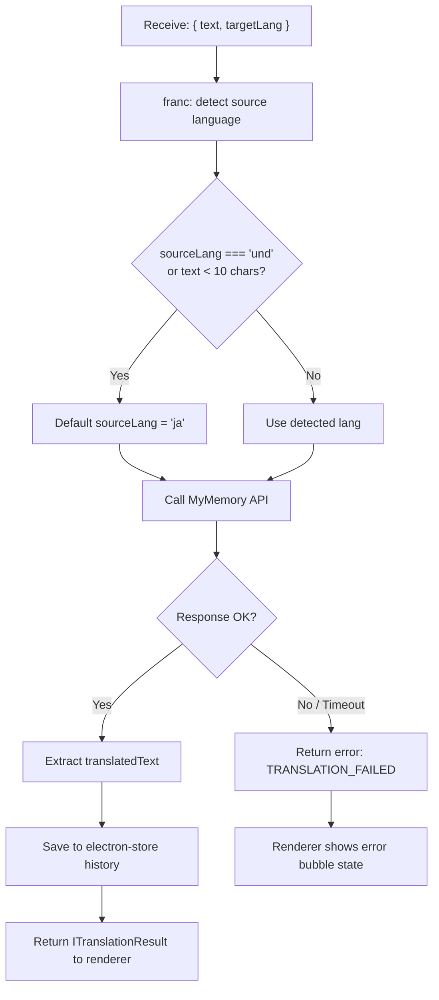

# Feature 03 — Translation Pipeline

## Overview

The core translation engine. Receives raw selected text, detects its source language, calls the MyMemory free translation API, caches the result in electron-store history, and returns a structured result to the renderer for bubble display.

## Scope

**Included:**

- Source language auto-detection via `franc`
- MyMemory API integration (free, no key required for basic use)
- Translation result caching in electron-store history (max 500 entries)
- Language pair configuration: source auto-detected, target from user settings
- Error handling for API failures with typed error codes
- 10-second request timeout

**Excluded:**

- AI improvement step (Feature 05)
- Bubble display (Feature 04)
- Alternative translation providers (v1: MyMemory only)

## User Stories

### US-03-A: Text is auto-detected and translated

**As a** manga reader,
**I want** Mantra to automatically detect the source language and translate to my preferred language,
**So that** I don't have to manually specify what language the manga text is in.

**Acceptance Criteria:**

- [ ] franc correctly identifies Japanese (`jpn`), Chinese (`zho`), Korean (`kor`) for typical manga text
- [ ] Auto-detected language is shown as a badge in the translation bubble
- [ ] If franc returns `und` (undetermined, common for very short strings <10 chars), default source lang to `ja`
- [ ] Translation is returned within 3 seconds on standard broadband
- [ ] Target language defaults to `id` (Indonesian) unless changed in Settings

### US-03-B: Failed translations show a clear error state

**As a** user,
**I want** to see a clear error message if translation fails,
**So that** I know what went wrong and what to do next.

**Acceptance Criteria:**

- [ ] If MyMemory returns non-200 or empty `translatedText`, bubble shows error state (red border, error message)
- [ ] Error message is human-readable: "Translation failed. Check your internet connection."
- [ ] Retry button visible in error state
- [ ] Original text still visible in error state bubble (so user can manually copy)

### US-03-C: Translations are cached in history

**As a** user,
**I want** my recent translations to be saved,
**So that** I can review what I've translated earlier in a session.

**Acceptance Criteria:**

- [ ] Every successful translation is saved to electron-store history array
- [ ] History is capped at 500 entries (oldest entry evicted when exceeded)
- [ ] Each history entry contains: id, originalText, translatedText, sourceLang, targetLang, createdAt
- [ ] History persists across app restarts

## User Flow



## API Integration

### MyMemory API

```
Endpoint: GET https://api.mymemory.translated.net/get
No API key required (free tier: 100k chars/day per IP)

Query params:
  q         — text to translate
  langpair  — "{sourceLang}|{targetLang}" (e.g. "ja|id")

Response (success):
{
  "responseStatus": 200,
  "responseData": {
    "translatedText": "Terjemahan di sini",
    "match": 0.9
  }
}

Response (error):
{
  "responseStatus": 403,
  "responseData": { "translatedText": "MYMEMORY WARNING: ..." }
}
```

### Language Code Mapping (franc ISO 639-3 → MyMemory ISO 639-1)

```typescript
// src/renderer/services/language-detect.ts
const FRANC_TO_MYMEMORY: Record<string, string> = {
  jpn: 'ja',
  zho: 'zh',
  kor: 'ko',
  eng: 'en',
  ind: 'id',
  und: 'ja' // undetermined → assume Japanese for manga context
}

export function detectAndMap(text: string): string {
  const { franc } = require('franc')
  const iso3 = franc(text, { minLength: 3 })
  return FRANC_TO_MYMEMORY[iso3] ?? 'ja'
}
```

### Translation Service Implementation

```typescript
// src/renderer/services/translation.ts
import axios from 'axios'
import { ITranslationRequest, ITranslationResult } from '../types'
import { detectAndMap } from './language-detect'

const MYMEMORY_URL = 'https://api.mymemory.translated.net/get'

export async function translateText(request: ITranslationRequest): Promise<ITranslationResult> {
  const sourceLang = request.sourceLang ?? detectAndMap(request.text)

  const response = await axios.get(MYMEMORY_URL, {
    params: {
      q: request.text,
      langpair: `${sourceLang}|${request.targetLang}`
    },
    timeout: 10_000
  })

  const data = response.data

  if (
    data.responseStatus !== 200 ||
    !data.responseData?.translatedText ||
    data.responseData.translatedText.startsWith('MYMEMORY WARNING')
  ) {
    throw { code: 'TRANSLATION_FAILED', message: 'MyMemory API returned an error.' }
  }

  return {
    translatedText: data.responseData.translatedText,
    sourceLang,
    targetLang: request.targetLang,
    provider: 'mymemory'
  }
}
```

### IPC Handler (main process)

```typescript
// src/main/ipc-handlers.ts
ipcMain.handle('translate-text', async (_, request: ITranslationRequest) => {
  try {
    const result = await translateText(request)

    // Save to history
    const entry = {
      id: nanoid(),
      originalText: request.text,
      translatedText: result.translatedText,
      sourceLang: result.sourceLang,
      targetLang: result.targetLang,
      createdAt: Date.now()
    }

    const history: any[] = store.get('history', [])
    history.unshift(entry)
    if (history.length > 500) history.pop()
    store.set('history', history)

    return { data: { ...result, id: entry.id } }
  } catch (error: any) {
    return {
      error: {
        code: error.code ?? 'TRANSLATION_FAILED',
        message: error.message ?? 'Translation failed.'
      }
    }
  }
})
```

## Edge Cases

| Case                                                 | Expected Behavior                                                                                      |
| ---------------------------------------------------- | ------------------------------------------------------------------------------------------------------ |
| Text is already in target language (e.g. Indonesian) | Translate anyway; MyMemory returns identical or trivially modified text                                |
| Text contains only numbers or punctuation            | franc returns `und`; default to `ja`; MyMemory returns same text                                       |
| Text length = 0 (caught upstream in Feature 02)      | Should never reach this service; guard with early return error                                         |
| MyMemory daily limit (100k chars) reached            | API returns 429 or warning string; show error: "Daily limit reached. Try again tomorrow."              |
| Internet offline                                     | axios timeout fires at 10s; show TRANSLATION_FAILED error                                              |
| Very long text (2000 chars, truncated by Feature 02) | MyMemory handles up to 500 chars per request; if text > 500, split into chunks and concatenate results |
| Source and target language identical                 | Still calls API; don't special-case this in v1                                                         |

> ⚠️ ASSUMPTION: MyMemory free tier (100k chars/day per IP) is sufficient for a typical manga reading session (estimated 200–500 chars per panel × 20 panels = ~10k chars/session). No rate limit handling beyond the daily cap is needed in v1.

## Definition of Done

- [ ] franc correctly identifies Japanese for sample manga text (manual test with 10 samples)
- [ ] MyMemory API returns correct Indonesian translation for 3 test phrases
- [ ] Timeout fires at exactly 10 seconds when network is disabled
- [ ] TRANSLATION_FAILED error returned with correct code and message
- [ ] History entry saved to electron-store after successful translation
- [ ] History capped at 500 entries (insert 501st, verify first entry evicted)
- [ ] `docs/04_dev_log.md` updated
- [ ] Status in `docs/00_master_plan.md` updated to ✅ Done
