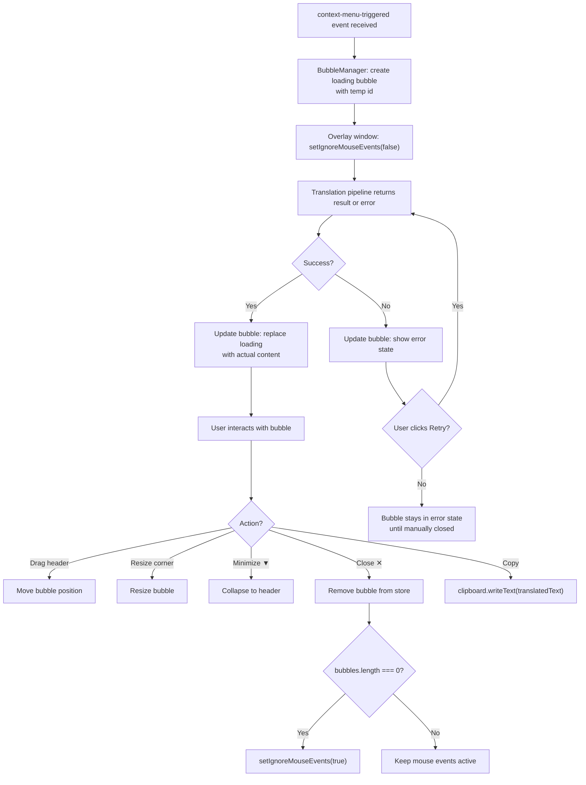

# Feature 04 — Draggable Translation Bubbles UI

## Overview

The primary user-facing interface. Renders floating translation bubbles on the always-on-top overlay window, positioned near the top-left by default (stacked if multiple). Each bubble shows original text, translated text, source language badge, and action buttons. Bubbles are draggable, resizable, minimizable, and closeable individually or all at once.

## Scope

**Included:**

- TranslationBubble component (draggable + resizable via react-rnd)
- BubbleManager: orchestrates multiple bubbles, handles add/remove/clear
- Zustand store for bubble state
- Mouse event toggle (click-through when no bubbles active)
- Minimize to header-only mode per bubble
- Close individual bubble / "Close All" from a persistent tray counter
- Error state variant of bubble (red border, retry button)
- Loading state (skeleton / spinner while translation in progress)
- Copy translated text to clipboard button

**Excluded:**

- AI improvement UI within bubble (Feature 05 adds ✨ Improve button to this component)
- Translation history list view (out of scope v1)
- Bubble arrow/connector to source text position on screen (v1: no connector line)

## User Stories

### US-04-A: Translation bubble appears near top-left after translation

**As a** manga reader,
**I want** the translation result to appear as a floating bubble I can see immediately,
**So that** I don't have to click anything else to read the result.

**Acceptance Criteria:**

- [ ] Bubble appears within 500ms of translation result being returned by Feature 03
- [ ] First bubble positions at { x: 24, y: 24 } (24px from top-left of screen)
- [ ] Each subsequent bubble offsets by +20px x and +20px y from the previous
- [ ] Bubble shows: original text, translated text, source language badge, timestamp
- [ ] Bubble width is 280px by default; height adjusts to content

### US-04-B: Bubbles are draggable and resizable

**As a** user,
**I want** to reposition and resize translation bubbles,
**So that** I can move them out of the way without closing them.

**Acceptance Criteria:**

- [ ] Dragging the bubble header moves the bubble freely anywhere on screen
- [ ] Bubble can be resized by dragging bottom-right corner (min: 200px, max: 500px width)
- [ ] Position persists for the session (does not reset to default on content update)
- [ ] Cursor changes to `grab` on header hover, `grabbing` while dragging

### US-04-C: Bubble can be minimized to header-only

**As a** user,
**I want** to collapse a bubble to just its header bar,
**So that** I can keep many translations open without cluttering the screen.

**Acceptance Criteria:**

- [ ] Clicking minimize icon (▼) collapses bubble to show only the header bar (36px height)
- [ ] Clicking again (▲) expands to full content
- [ ] Position and size are preserved when expanding
- [ ] Minimized bubble still shows original text in header as a truncated label (max 30 chars)

### US-04-D: Individual and bulk close

**As a** user,
**I want** to close translation bubbles I no longer need,
**So that** the overlay doesn't fill up with old translations.

**Acceptance Criteria:**

- [ ] Clicking ✕ on a bubble removes it from the overlay
- [ ] A persistent counter at bottom-right of screen shows active bubble count (hidden when 0)
- [ ] Counter has a "Close All" button that dismisses all bubbles at once
- [ ] Pressing Escape closes the most recently created (topmost) bubble

### US-04-E: Loading and error states

**As a** user,
**I want** to see immediate visual feedback while translation is processing,
**So that** I know Mantra received my request.

**Acceptance Criteria:**

- [ ] A loading bubble (skeleton animation) appears within 100ms of context menu trigger
- [ ] Loading bubble shows "Translating..." text in translated section
- [ ] On error, bubble border turns red; shows error message and "Retry" button
- [ ] Clicking Retry re-triggers the translation call with same original text
- [ ] On success, skeleton replaced with actual content (no flash/jump in position)

## User Flow



## Component Architecture

```
BubbleManager (container)
├── Zustand: useBubbleStore
│   ├── bubbles: IBubble[]
│   ├── addBubble(bubble: IBubble)
│   ├── updateBubble(id, partial: Partial<IBubble>)
│   └── removeBubble(id)
│
├── TranslationBubble (per bubble)
│   ├── react-rnd wrapper (drag + resize)
│   ├── BubbleHeader (drag handle, minimize, close)
│   ├── BubbleContent
│   │   ├── OriginalSection (text + language badge)
│   │   ├── TranslatedSection (translated text)
│   │   └── ActionRow (Copy, [Improve — added in Feature 05])
│   └── BubbleFooter (timestamp, source lang)
│
└── BubbleCounter (fixed bottom-right)
    ├── Count badge
    └── Close All button
```

## Zustand Store

```typescript
// src/renderer/store/bubbles.ts
import { create } from 'zustand'
import { IBubble } from '../types'

interface IBubbleStore {
  bubbles: IBubble[]
  addBubble: (bubble: IBubble) => void
  updateBubble: (id: string, partial: Partial<IBubble>) => void
  removeBubble: (id: string) => void
  clearAll: () => void
}

export const useBubbleStore = create<IBubbleStore>((set) => ({
  bubbles: [],
  addBubble: (bubble) => set((s) => ({ bubbles: [...s.bubbles, bubble] })),
  updateBubble: (id, partial) =>
    set((s) => ({
      bubbles: s.bubbles.map((b) => (b.id === id ? { ...b, ...partial } : b))
    })),
  removeBubble: (id) => set((s) => ({ bubbles: s.bubbles.filter((b) => b.id !== id) })),
  clearAll: () => set({ bubbles: [] })
}))
```

## Edge Cases

| Case                                                        | Expected Behavior                                                              |
| ----------------------------------------------------------- | ------------------------------------------------------------------------------ |
| User drags bubble off screen edge                           | Bubble can go partially off-screen; no clipping constraint in v1               |
| 10+ bubbles open simultaneously                             | All render; performance tested up to 10 concurrent bubbles                     |
| Bubble content is very long (>500 chars translated)         | Text truncated at 300 chars with "Show more" expand toggle                     |
| User rapidly triggers 5 translations before first completes | All 5 loading bubbles created; each resolves independently                     |
| Translated text identical to original (translation no-op)   | Display as normal; no special case                                             |
| User presses Escape with no bubbles                         | No action, no error                                                            |
| Screen resolution changes while bubbles are open            | Bubbles stay at their absolute pixel positions; may need repositioning by user |

## Definition of Done

- [ ] Bubble appears within 500ms of translation result
- [ ] Drag works on header; resize works on corner
- [ ] Minimize/expand cycle preserves position and size
- [ ] Close individual bubble removes from store
- [ ] Close All clears all bubbles
- [ ] Escape closes topmost bubble
- [ ] setIgnoreMouseEvents toggles correctly with bubble count
- [ ] Loading state (skeleton) visible before result arrives
- [ ] Error state shows with red border and Retry button
- [ ] Retry re-calls translation and updates bubble on success
- [ ] Copy button writes translatedText to clipboard
- [ ] Up to 10 concurrent bubbles render without visible lag
- [ ] `docs/04_dev_log.md` updated
- [ ] Status in `docs/00_master_plan.md` updated to ✅ Done
