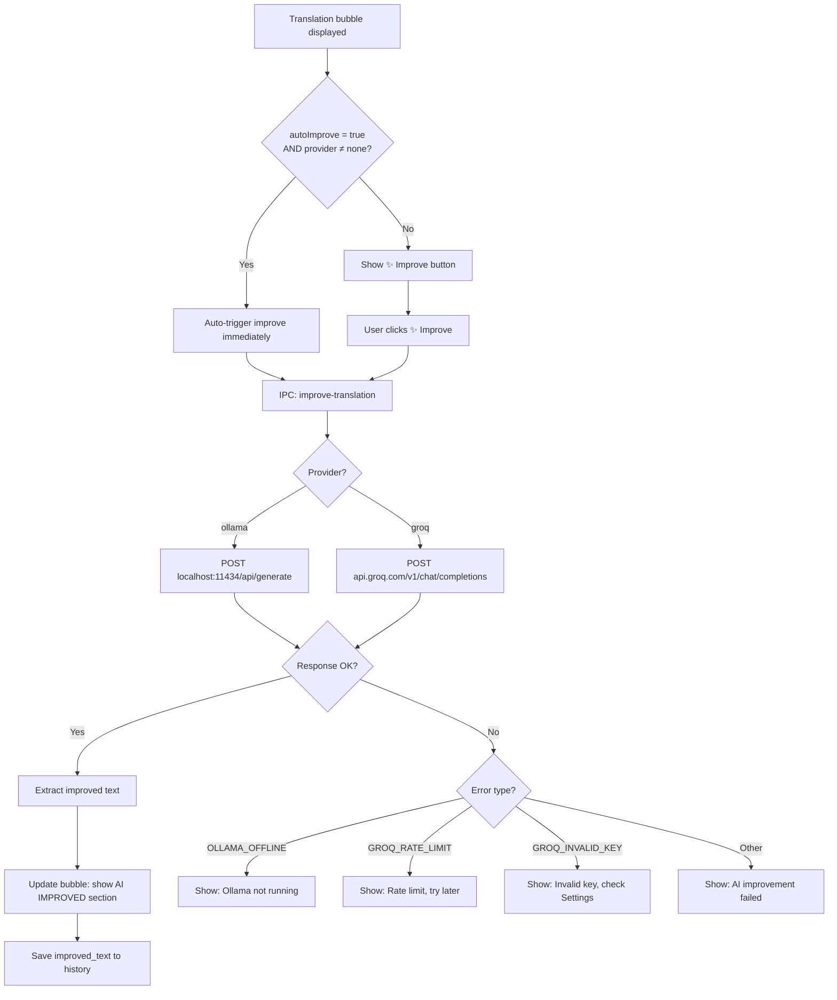

# Feature 05 — AI Improvement Layer

## Overview
An optional post-translation step that rewrites raw machine translation output into natural-sounding manga dialogue using a local LLM (Ollama) or cloud API (Groq). Exposed as a "✨ Improve" button inside each translation bubble. The AI provider, model, and API keys are configured entirely through the Settings panel (Feature 06).

## Scope
**Included:**
- Ollama integration (local LLM, `http://localhost:11434/api/generate`)
- Groq API integration (cloud, free tier, `https://api.groq.com/openai/v1/chat/completions`)
- Prompt template for manga context naturalisation
- "✨ Improve" button added to TranslationBubble action row (extends Feature 04 component)
- Toggle between raw translation and AI-improved version within the same bubble
- Auto-improve option: if enabled in Settings, improvement triggers automatically after translation
- Error handling: OLLAMA_OFFLINE, GROQ_RATE_LIMIT, GROQ_INVALID_KEY, AI_IMPROVE_FAILED
- AI improvement result saved to history entry (`improved_text` field)

**Excluded:**
- Fine-tuning or custom model upload
- Provider other than Ollama and Groq in v1
- Streaming AI response (full response returned at once in v1)
- Per-bubble provider override (provider comes from Settings only)

## User Stories

### US-05-A: User manually triggers AI improvement
**As a** manga reader who got a stiff translation,
**I want** to click "✨ Improve" on a bubble to get a more natural-sounding version,
**So that** I understand the dialogue as a manga reader would.

**Acceptance Criteria:**
- [ ] "✨ Improve" button is visible in bubble action row only if AI provider ≠ "none" in Settings
- [ ] Clicking "✨ Improve" shows a loading indicator inside the button ("Improving...")
- [ ] Improved text appears in the bubble (purple accent section) within 10 seconds
- [ ] Original translated text remains accessible via "Show original" toggle
- [ ] Improved text is stored in the history entry (`improved_text`)

### US-05-B: Toggle between original and improved translation
**As a** user,
**I want** to switch between the raw translation and the AI-improved version,
**So that** I can compare or fall back to the literal translation if needed.

**Acceptance Criteria:**
- [ ] After improvement, bubble shows two sections: "TERJEMAHAN" (raw) and "AI IMPROVED" (improved), with a toggle
- [ ] Toggle label reads: "Show Raw" / "Show Improved"
- [ ] Copy button always copies the currently visible version (raw or improved)
- [ ] Default view after improvement: show the improved version

### US-05-C: Auto-improve triggers without user interaction
**As a** power user,
**I want** every translation to be automatically improved without clicking,
**So that** I always get natural-sounding text immediately.

**Acceptance Criteria:**
- [ ] If `autoImprove = true` in Settings and AI provider ≠ "none", improvement starts immediately after translation completes
- [ ] Bubble shows "Translating..." then "Improving..." in sequence
- [ ] Total time (translate + improve): shown in bubble footer as "2.4s" style duration
- [ ] If improvement fails (e.g. Ollama offline), bubble still shows raw translation with error note: "AI unavailable"

### US-05-D: Provider errors shown clearly
**As a** user whose Ollama is not running,
**I want** to see a clear error explaining why improvement failed,
**So that** I know whether to start Ollama or check my API key.

**Acceptance Criteria:**
- [ ] OLLAMA_OFFLINE → message: "Ollama is not running. Start Ollama and try again."
- [ ] GROQ_RATE_LIMIT → message: "Groq rate limit reached. Try again in a moment."
- [ ] GROQ_INVALID_KEY → message: "Groq API key is invalid. Update it in Settings."
- [ ] All error messages appear inside the bubble (not as a toast or system notification)
- [ ] Error does not affect raw translation which remains visible

## User Flow


## Implementation Notes

### Prompt Template
```typescript
// src/renderer/services/ai-improver.ts

const IMPROVE_PROMPT = (original: string, translated: string, targetLang: string) => `
You are a manga translation naturalizer. Your job is to rewrite machine-translated manga dialogue so it sounds natural and emotionally appropriate for the scene.

Original text: "${original}"
Machine translation: "${translated}"
Target language: ${targetLang === 'id' ? 'Indonesian (Bahasa Indonesia)' : targetLang}

Rules:
1. Keep the same meaning — do not add or remove information
2. Use casual, manga-appropriate tone (characters in manga rarely speak formally)
3. Match emotional intensity (shouting, whispering, dramatic, comedic)
4. Return ONLY the improved translation — no explanations, no labels, no quotes
5. If the machine translation is already natural, return it unchanged
`.trim();
```

### Ollama Integration
```typescript
async improveWithOllama(prompt: string, model: string, baseUrl: string): Promise<string> {
  const response = await axios.post(
    `${baseUrl}/api/generate`,
    {
      model,
      prompt,
      stream: false,
      options: { temperature: 0.7, num_predict: 200 }
    },
    { timeout: 30_000 }  // Ollama can be slow on first token
  );

  if (!response.data?.response) {
    throw { code: 'AI_IMPROVE_FAILED', message: 'Ollama returned empty response.' };
  }
  return response.data.response.trim();
}
```

### Groq Integration
```typescript
async improveWithGroq(prompt: string, apiKey: string): Promise<string> {
  const response = await axios.post(
    'https://api.groq.com/openai/v1/chat/completions',
    {
      model: 'mixtral-8x7b-32768',
      messages: [{ role: 'user', content: prompt }],
      temperature: 0.7,
      max_tokens: 200,
    },
    {
      headers: { Authorization: `Bearer ${apiKey}` },
      timeout: 15_000,
    }
  );

  const text = response.data?.choices?.[0]?.message?.content?.trim();
  if (!text) throw { code: 'AI_IMPROVE_FAILED', message: 'Groq returned empty response.' };
  return text;
}
```

### IPC Handler
```typescript
ipcMain.handle('improve-translation', async (_, req: IAIImproveRequest) => {
  try {
    const settings: ISettings = store.get('settings');
    const prompt = IMPROVE_PROMPT(req.originalText, req.translatedText, req.targetLang);

    let improvedText: string;
    if (req.provider === 'ollama') {
      improvedText = await improveWithOllama(prompt, settings.ollamaModel, settings.ollamaBaseUrl);
    } else {
      const apiKey = safeStorage.decryptString(
        Buffer.from(settings.groqApiKey, 'base64')
      );
      improvedText = await improveWithGroq(prompt, apiKey);
    }

    return { data: { improvedText } };
  } catch (error: any) {
    return {
      error: {
        code: error.code ?? 'AI_IMPROVE_FAILED',
        message: error.message ?? 'AI improvement failed.',
      }
    };
  }
});
```

## Edge Cases
| Case | Expected Behavior |
|------|------------------|
| Ollama is installed but model not pulled | Response: 404 from Ollama → OLLAMA_MODEL_NOT_FOUND → "Model not found. Run: ollama pull mistral" |
| Groq API key contains whitespace (user copy-paste error) | Strip whitespace before sending; show warning in Settings: "Key has been trimmed" |
| AI returns same text as raw translation | Display normally; no special case |
| AI returns text in wrong language (hallucination) | Display as-is; no language validation in v1 |
| autoImprove = true but AI provider = none | Guard: if provider = none, never auto-trigger; button hidden |
| Improvement takes >10s (Groq), >30s (Ollama) | Timeout fires; show error; raw translation remains |
| User clicks Improve multiple times | Debounce: ignore subsequent clicks while in-flight |
| History entry already has improved_text, user clicks Improve again | Overwrite with new improved_text; no confirm prompt |

## Definition of Done
- [ ] "✨ Improve" button visible only when AI provider ≠ "none"
- [ ] Ollama integration returns improved text for sample Japanese manga sentence
- [ ] Groq integration returns improved text for same sample
- [ ] autoImprove triggers without user interaction when enabled
- [ ] Toggle between raw and improved works in both directions
- [ ] Copy button copies the currently displayed version
- [ ] OLLAMA_OFFLINE error displays correct message inside bubble
- [ ] GROQ_INVALID_KEY error displays correct message inside bubble
- [ ] GROQ_RATE_LIMIT error displays correct message inside bubble
- [ ] Improved text saved to history entry `improved_text` field
- [ ] Debounce prevents multiple simultaneous improvement calls per bubble
- [ ] `docs/04_dev_log.md` updated
- [ ] Status in `docs/00_master_plan.md` updated to ✅ Done
