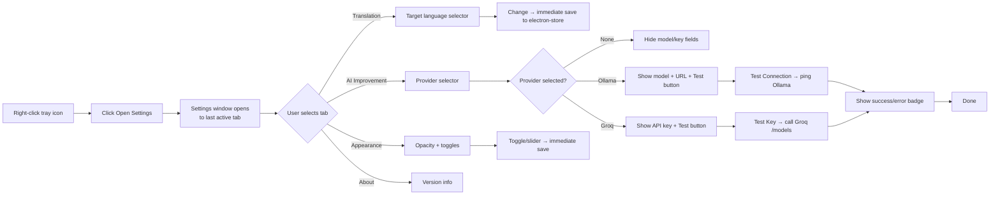

# Feature 06 — Settings Panel

## Overview

A dedicated, non-modal settings window where users can configure all Mantra preferences without touching any config files or terminal. Organized into four tabs: Translation, AI Improvement, Appearance, and About. All settings are persisted immediately on change via electron-store.

## Scope

**Included:**

- Four-tab Settings panel (Translation, AI Improvement, Appearance, About)
- Translation tab: target language selector
- AI Improvement tab: provider selector (None / Ollama / Groq), Ollama model + URL, Groq API key input (masked), auto-improve toggle, connection test button
- Appearance tab: bubble opacity slider, start-on-boot toggle, minimize-to-tray toggle
- About tab: app version, changelog link, open-source licenses
- Immediate persistence on field change (no explicit "Save" button except for API key)
- Connection test for Ollama (ping localhost) and Groq (validate key via /models endpoint)
- Settings state synced to Zustand `useSettingsStore` so renderer reflects changes live

**Excluded:**

- Theme switching / dark-light mode (v1 is dark only)
- Translation history viewer (out of scope v1)
- Export/import settings
- Multiple AI provider profiles

## User Stories

### US-06-A: User sets target language

**As a** user,
**I want** to select my preferred translation language from a dropdown,
**So that** all future translations default to my language.

**Acceptance Criteria:**

- [ ] "Target Language" select shows: Indonesian (id), English (en), Chinese (zh), Korean (ko) — expandable later
- [ ] Changing selection saves immediately to electron-store
- [ ] All new translations after change use the new target language
- [ ] Current value shown in dropdown on Settings open

### US-06-B: User configures Ollama

**As a** power user running Ollama locally,
**I want** to select the Ollama model and base URL in Settings,
**So that** Mantra uses my local AI without any config files.

**Acceptance Criteria:**

- [ ] AI provider dropdown: "None", "Ollama (Local)", "Groq (Cloud)"
- [ ] Selecting "Ollama" shows: Model name input (default: "mistral"), Server URL input (default: "http://localhost:11434")
- [ ] "Test Connection" button sends a ping to the Ollama URL
- [ ] On success: green badge "Connected — mistral available"
- [ ] On failure: red badge "Cannot reach Ollama. Is it running?"
- [ ] Settings saved on field blur (not on every keystroke)

### US-06-C: User configures Groq API key

**As a** user who prefers cloud AI without running Ollama,
**I want** to paste my Groq API key and have Mantra validate it,
**So that** I know it's correctly set up before I start translating.

**Acceptance Criteria:**

- [ ] Groq API key field is type="password" by default (show/hide toggle)
- [ ] "Test Key" button calls Groq /openai/v1/models with the key
- [ ] On success: green badge "Key valid"
- [ ] On 401: red badge "Invalid key"
- [ ] Key stored via `safeStorage.encryptString()` in electron-store (never plain text)
- [ ] Key input shows placeholder "gsk\_..." to guide format
- [ ] Clearing the key field and saving removes the stored key

### US-06-D: User sets appearance preferences

**As a** user,
**I want** to control how Mantra looks and behaves on my Windows desktop,
**So that** it fits my workflow.

**Acceptance Criteria:**

- [ ] Bubble opacity slider: range 70%–100%, step 5%, default 95%; preview label shows current value
- [ ] "Start on boot" toggle: when ON, registers Mantra in Windows startup (HKCU Run key); when OFF, removes it
- [ ] "Minimize to tray" toggle: when ON, closing the Settings window goes to tray; when OFF, closes the Settings window (app keeps running via tray)
- [ ] All changes save immediately on interaction (no Save button needed for toggles/sliders)

### US-06-E: Settings window accessible from tray

**As a** user,
**I want** to always be able to open Settings from the tray icon,
**So that** I can adjust anything without hunting for the app.

**Acceptance Criteria:**

- [ ] Right-click tray → "Open Settings" opens Settings window
- [ ] If Settings already open, bring to front (no duplicate windows)
- [ ] Settings window title bar shows "Mantra Settings" and standard OS close button
- [ ] Settings window is not resizable

## User Flow



## Component Architecture

```
SettingsPanel (window root)
├── SettingsSidebar
│   └── NavItem × 4 (Translation, AI, Appearance, About)
└── SettingsContent
    ├── TranslationTab
    │   └── SettingRow: Target Language (Select)
    ├── AITab
    │   ├── SettingRow: AI Provider (Select: None | Ollama | Groq)
    │   ├── OllamaSection (conditional)
    │   │   ├── SettingRow: Model Name (Input)
    │   │   ├── SettingRow: Server URL (Input)
    │   │   └── TestConnectionButton
    │   ├── GroqSection (conditional)
    │   │   ├── SettingRow: API Key (PasswordInput + show/hide)
    │   │   └── TestKeyButton
    │   └── SettingRow: Auto-Improve (Toggle)
    ├── AppearanceTab
    │   ├── SettingRow: Bubble Opacity (Slider + value label)
    │   ├── SettingRow: Start on Boot (Toggle)
    │   └── SettingRow: Minimize to Tray (Toggle)
    └── AboutTab
        ├── App logo + version
        ├── Link: Changelog
        └── Link: Open Source Licenses
```

## Zustand Settings Store

```typescript
// src/renderer/store/settings.ts
import { create } from 'zustand'
import { ISettings } from '../types'

interface ISettingsStore {
  settings: ISettings
  loadSettings: () => Promise<void>
  updateSetting: <K extends keyof ISettings>(key: K, value: ISettings[K]) => Promise<void>
}

export const useSettingsStore = create<ISettingsStore>((set) => ({
  settings: {} as ISettings,

  loadSettings: async () => {
    const settings = await window.electronAPI.getSettings()
    set({ settings })
  },

  updateSetting: async (key, value) => {
    set((s) => ({ settings: { ...s.settings, [key]: value } }))
    await window.electronAPI.saveSettings({ [key]: value })
  }
}))
```

## IPC Handlers

```typescript
ipcMain.handle('get-settings', () => {
  return { data: store.get('settings') }
})

ipcMain.handle('save-settings', (_, partial: Partial<ISettings>) => {
  try {
    const current = store.get('settings') as ISettings

    // Special handling for Groq key — encrypt before storing
    if (partial.groqApiKey !== undefined) {
      partial.groqApiKey = partial.groqApiKey
        ? safeStorage.encryptString(partial.groqApiKey).toString('base64')
        : ''
    }

    // Handle start-on-boot via Windows registry
    if (partial.startOnBoot !== undefined) {
      const exePath = app.getPath('exe')
      const runKey = 'HKCU\\Software\\Microsoft\\Windows\\CurrentVersion\\Run'
      if (partial.startOnBoot) {
        execSync(`reg add "${runKey}" /v "Mantra" /t REG_SZ /d "${exePath}" /f`)
      } else {
        execSync(`reg delete "${runKey}" /v "Mantra" /f`)
      }
    }

    store.set('settings', { ...current, ...partial })
    return { data: { success: true } }
  } catch (error: any) {
    return { error: { code: 'SETTINGS_SAVE_FAILED', message: error.message } }
  }
})

// Ollama connection test
ipcMain.handle('test-ollama', async (_, { baseUrl, model }: { baseUrl: string; model: string }) => {
  try {
    const response = await axios.get(`${baseUrl}/api/tags`, { timeout: 5_000 })
    const models = response.data?.models ?? []
    const found = models.some((m: any) => m.name.startsWith(model))
    return { data: { connected: true, modelFound: found } }
  } catch {
    return { data: { connected: false, modelFound: false } }
  }
})

// Groq key test
ipcMain.handle('test-groq', async (_, { apiKey }: { apiKey: string }) => {
  try {
    await axios.get('https://api.groq.com/openai/v1/models', {
      headers: { Authorization: `Bearer ${apiKey.trim()}` },
      timeout: 5_000
    })
    return { data: { valid: true } }
  } catch (error: any) {
    return { data: { valid: false, status: error.response?.status ?? 0 } }
  }
})
```

## Edge Cases

| Case                                                    | Expected Behavior                                                                                             |
| ------------------------------------------------------- | ------------------------------------------------------------------------------------------------------------- |
| User switches from Groq to Ollama without clearing key  | Key remains encrypted in store; Groq section hidden; key not deleted                                          |
| Ollama URL is valid but model not pulled                | Connected: true, modelFound: false → badge: "Connected — model 'mistral' not found. Run: ollama pull mistral" |
| Groq key has trailing newline (copy from terminal)      | Trimmed before test and before storing                                                                        |
| User opens Settings while improvement is in-progress    | In-progress improvement continues; no interruption                                                            |
| Start on boot toggled OFF when Mantra wasn't in startup | reg delete fails silently (key not found); no error shown                                                     |
| Opacity slider set to 70%                               | All currently open bubbles update opacity live (no restart needed)                                            |
| Settings window opened while Settings already open      | Focus existing window; no second window                                                                       |

## Definition of Done

- [ ] All four tabs render without errors
- [ ] Target language change persists and reflects in next translation
- [ ] AI provider switching shows/hides correct fields
- [ ] Ollama test: green badge on success, red on offline
- [ ] Groq test: green on valid key, red on 401
- [ ] Groq key stored encrypted (verify %APPDATA%/mantra/config.json never shows plain key)
- [ ] Auto-improve toggle: when ON, improvement triggers without "✨ Improve" click
- [ ] Bubble opacity slider updates live across open bubbles
- [ ] Start on boot: verify Mantra appears in Task Manager startup list after toggle ON
- [ ] Settings window cannot be opened twice
- [ ] `docs/04_dev_log.md` updated
- [ ] Status in `docs/00_master_plan.md` updated to ✅ Done
